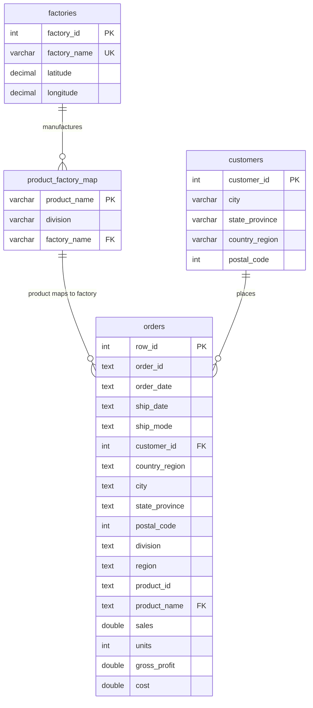

# Entity-Relationship Diagram

**Design notes**
- `orders` is the fact table (9,994 rows) — the real Nassau Candy dataset,
  imported via MySQL Workbench's Table Data Import Wizard.
- `factories` and `product_factory_map` are reference tables built manually
  from the business brief, since factory and product-to-factory mapping
  data don't exist in the source CSV.
- `customers` is normalized out of `orders` — each customer's city/state/
  country is stored once instead of repeated on every order row.
- `orders.customer_id` is a foreign key to `customers`, with `ON DELETE
  SET NULL` — if a customer record is removed, their past orders remain
  but the link is cleared rather than the order being deleted.
- `Ship Date` is present in `orders` but excluded from analysis — see the
  Data Quality Note in the README for why.
