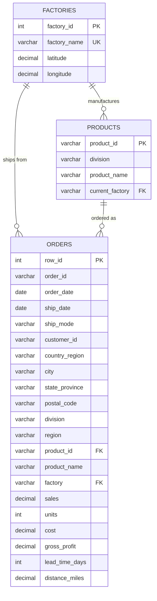

# Entity-Relationship Diagram

**Design notes**
- `orders` is the fact table (one row per order line item, ~9,100 rows / 4,500 orders).
- `products` and `factories` are dimension tables; `products.current_factory` captures the
  static "as-is" assignment described in the business problem.
- `lead_time_days` and `distance_miles` are derived columns computed at load time
  (ship_date − order_date; haversine distance from factory to customer region) — this
  is what makes the regression / simulation queries possible without extra joins.
- The optimization engine (`03_optimization_engine.sql`) adds two supporting objects:
  `region_centroids` (reference table) and `vw_factory_region_distance` (a view that
  computes the full factory × region distance matrix used for "what-if" scenarios).
